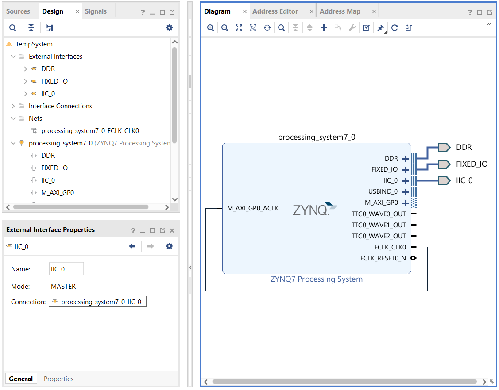
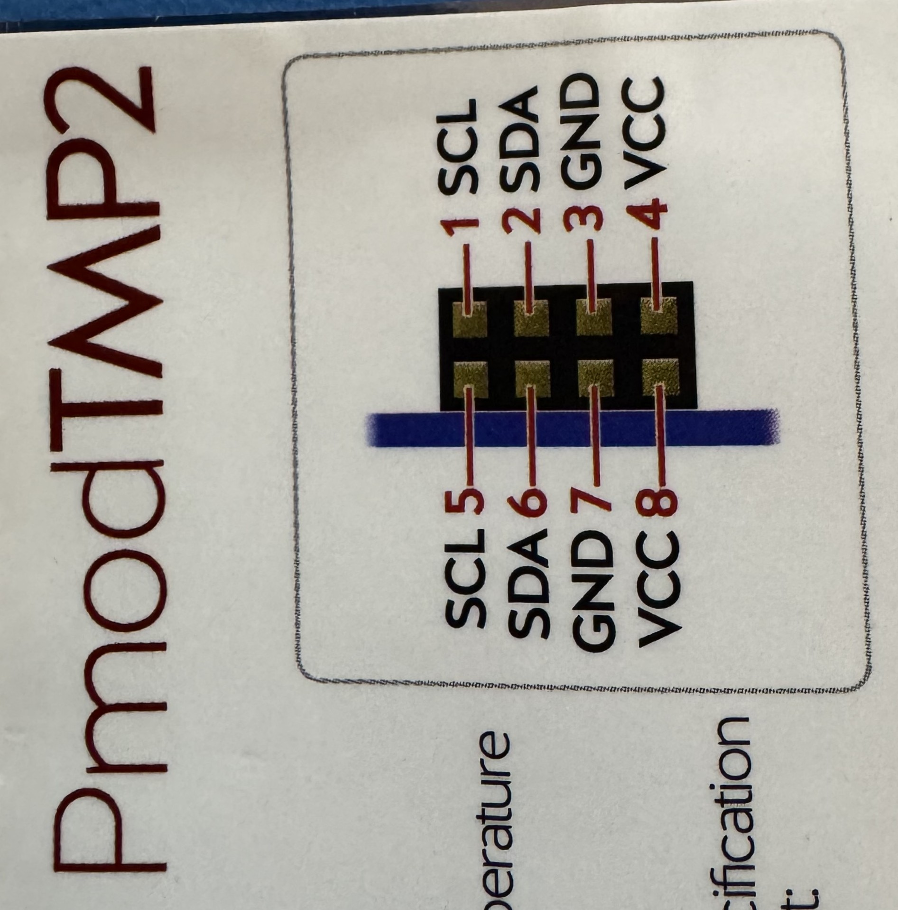
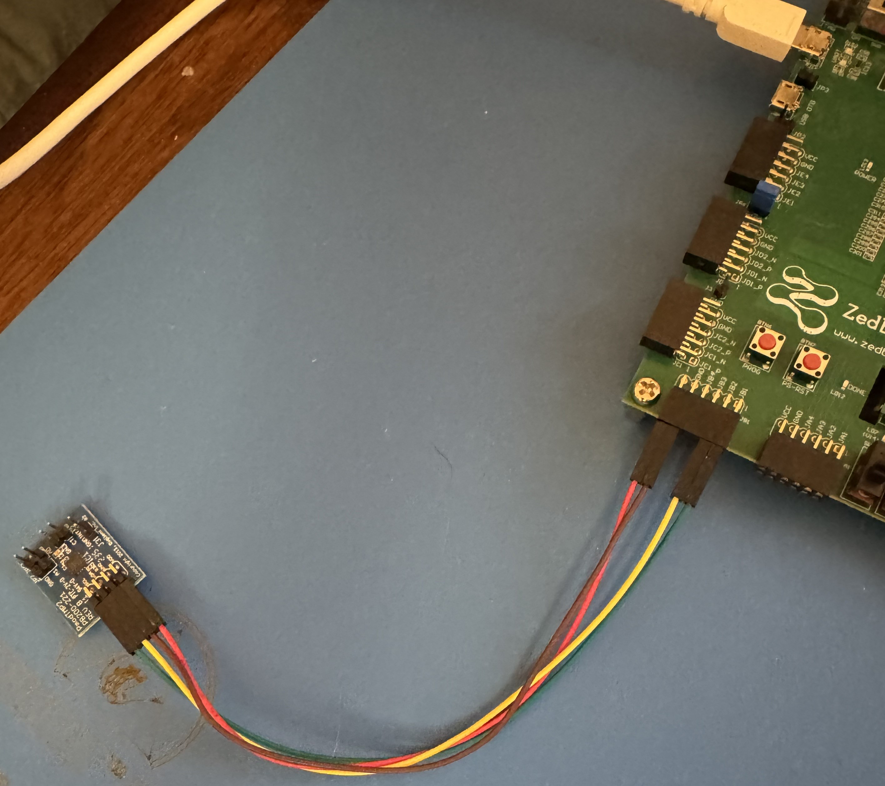

# Project Walkthrough

**Vivado:** 2025.2.1 · **Vitis:** 2025.2 · **Board:** ZedBoard · **Sensor:** Pmod TMP2 (ADT7420)

End-to-end steps: Vivado block design → pin constraints → hardware connections → Vitis application → run.

---

## Key Concepts

- **EMIO (Extended MIO):** Routes PS peripherals (like I2C0) through the PL fabric to user-chosen FPGA pins, rather than the fixed MIO pins. Required here because the JB connector pins are not MIO-accessible.
- **IIC interface vs. scalar ports:** The PS block exposes I2C0 as an interface bundle (`IIC_0`) containing SDA and SCL, or as 6 individual tri-state scalar signals (`_I`, `_O`, `_T` for each line). Making the bundle external is the correct approach.
- **IOBUF:** A Xilinx primitive that merges a tri-state output (`O`), input (`I`), and direction control (`T`) into a single bidirectional physical pin (`IO`). Required because I2C is open-drain bidirectional. Vivado instantiates this automatically when the IIC interface is made external as a bus.
- **XDC (Xilinx Design Constraints):** Tcl-based file that maps logical port names to physical package pins and sets electrical properties.
- **LVCMOS33:** 3.3V CMOS I/O standard. Required for JB connector pins (bank 13 on ZedBoard is 3.3V).
- **PULLTYPE PULLUP:** Enables the FPGA's internal pull-up resistor. Mandatory for I2C open-drain lines — without it, SDA and SCL cannot return to logic high between transactions.
- **Platform component:** Generated from the `.xsa`. Contains BSP, FSBL, linker scripts, and hardware-specific parameters (`xparameters.h`).
- **XIicPs:** Xilinx bare-metal driver for the PS I2C controller. Used in polled mode here — no interrupts.
- **ADT7420 13-bit mode:** Default power-on mode. Temperature register is 16 bits; the lower 3 bits are unused flags. Right-shift by 3 to get the signed 13-bit value. Resolution is 0.0625°C per LSB.

---

## Part 1 — Vivado Block Design

### 1. Create Project

1. Open Vivado → **Create Project**
2. Project type: **RTL Project**, check *Do not specify sources at this time*
3. No constraints at this stage
4. Board: **ZedBoard Zynq Evaluation and Development Kit**
5. Finish

### 2. Create Block Design

1. In the Flow Navigator: **IP Integrator → Create Block Design**
2. Name: `tempSystem` → OK
3. Add IP: search and add **ZYNQ7 Processing System**
4. Click **Run Block Automation** → accept defaults → OK

### 3. Configure PS — Enable I2C_0 via EMIO

1. Double-click the **ZYNQ7 Processing System** block
2. Navigate to: **MIO Configuration → I/O Peripherals → I2C**
3. Enable **I2C_0**
4. Set the I2C_0 routing to **EMIO**
5. Click **OK**

> **Why EMIO?** The JB connector pins are PL pins, not PS MIO pins. EMIO routes the I2C0 peripheral signal through the PL fabric so it can be assigned to any FPGA pin via constraints.


### 4. Make IIC_0 External

1. On the PS block, locate the `IIC_0` interface port (appears after enabling I2C_0 via EMIO)
2. Right-click `IIC_0` → **Make External**

> **Critical:** Right-click the `IIC_0` interface port — the bus-level connection — not the individual scalar signals. Making the bus external causes Vivado to auto-generate the IOBUF primitives and collapses SDA and SCL into two clean bidirectional ports. No manual Verilog required.

> **Alternative (harder — avoid):** Making the 6 individual scalar ports (`I2C0_SCL_I_0`, `I2C0_SCL_O_0`, `I2C0_SCL_T_0`, `I2C0_SDA_I_0`, `I2C0_SDA_O_0`, `I2C0_SDA_T_0`) external individually requires manually instantiating `IOBUF` primitives in the generated HDL wrapper to merge them back into two bidirectional pins. Vivado will not let you assign multiple ports to the same physical pin, so the merge is required either way — the bus-level approach just does it for you.

3. Click on the newly created external port (named `IIC_0_0` by default)
4. In the **External Interface Properties** panel, rename it from `IIC_0_0` to `IIC_0` (remove the trailing `_0`)

- Connect ```FCLK_CLK0``` to ```M_AXI_GPO_ACLK``` 
  
> Renaming matters: the port name must match what you reference in the XDC constraints file. The extra `_0` suffix is a Vivado 2025 artifact.



### 5. Validate and Save

1. Click **Validate Design** (or press F6) — resolve any errors before proceeding
2. **Save** the block design (Ctrl+S)

### 6. Create HDL Wrapper

1. In Sources, right-click `tempSystem.bd` → **Create HDL Wrapper**
2. Select **Let Vivado manage wrapper and auto-update** → OK

> Do not edit the generated wrapper. The IOBUF instantiations are already handled. Proceed directly to synthesis.


---

## Part 2 — Pin Constraints & Synthesis

### 1. Run Synthesis

1. Flow Navigator → **Run Synthesis**
2. If synthesis fails to launch via the GUI button, use the Tcl console:
   ```tcl
   reset_run synth_1
   launch_runs synth_1 -jobs 2
   ```
   See [troubleshooting.md](troubleshooting.md) for the `[Common 17-180]` spawn error.

### 2. Open Synthesized Design and Assign Pins

1. After synthesis completes: **Open Synthesized Design**
2. Open IO Ports: **Window → I/O Ports**
3. Locate `IIC_0_scl_io` and `IIC_0_sda_io` under the IIC_0 interface group

Assign as follows:

| Port | Package Pin | I/O Std | Slew | Pull Type |
|------|-------------|---------|------|-----------|
| `IIC_0_scl_io` | W12 | LVCMOS33 | Slow | PULLUP |
| `IIC_0_sda_io` | W11 | LVCMOS33 | Slow | PULLUP |

> **Pull-ups are not optional.** I2C is open-drain — the line is pulled low to signal, and must be pulled high via FPGA internal pull-up to return to idle. Without PULLUP set here, the bus will hang.

> If you see 6 scalar ports (`I2C0_SCL_I_0`, `I2C0_SCL_O_0`, etc.) instead of 2 bidirectional ports, the IIC_0 interface was not made external as a bus — return to Part 1, Step 4.


### 3. Save Constraints

1. **File → Save Constraints** → name the file `tmp2.xdc`
2. Verify the saved file contains:

```xdc
set_property IOSTANDARD LVCMOS33 [get_ports IIC_0_scl_io]
set_property IOSTANDARD LVCMOS33 [get_ports IIC_0_sda_io]
set_property PULLTYPE PULLUP     [get_ports IIC_0_scl_io]
set_property PULLTYPE PULLUP     [get_ports IIC_0_sda_io]
set_property PACKAGE_PIN W12     [get_ports IIC_0_scl_io]
set_property PACKAGE_PIN W11     [get_ports IIC_0_sda_io]
```

> Port names in the XDC must exactly match the port names in synthesis. If the interface was left as `IIC_0_0`, the ports will be `IIC_0_0_scl_io` etc. — and constraints won't apply.

### 4. Run Implementation and Generate Bitstream

1. If synthesis is marked out-of-date after saving constraints: **Run Synthesis** again
2. **Run Implementation**
3. **Generate Bitstream**

### 5. Export Hardware

1. **File → Export → Export Hardware**
2. Select **Include bitstream**
3. Export as `.xsa` to a known location

> Changing the `.xsa` and importing it into an existing Vitis workspace has not worked reliably. Create a new Vitis workspace for every new `.xsa`. See [bugs_and_fixes.md](bugs_and_fixes.md) Bug #2.

---

## Part 3 — Hardware Connections

**Power off the ZedBoard before connecting anything.**

### Wiring Table

| ZedBoard JB | Package Pin | Pmod TMP2 Pin | Signal | Notes |
|-------------|-------------|---------------|--------|-------|
| JB1 (top row, pin 1) | W12 | Pin 1 or 5 | SCL | Pull-up set in XDC |
| JB2 (top row, pin 2) | W11 | Pin 2 or 6 | SDA | Pull-up set in XDC |
| JB5 (top row, pin 5) | — | VDD | 3.3V power | |
| JB6 (top row, pin 6) | — | GND | Ground | |

> All connections are on the **top row** of both the JB connector and the Pmod TMP2. The bottom row is not used.

### Pre-Connection Checklist

- [ ] Power off the ZedBoard
- [ ] Verify 3.3V between JB VCC and GND with a multimeter — the Pmod TMP2 has no power LED
- [ ] Confirm jumper cables are fully seated on both ends
- [ ] Do not hot-plug





### Direct Plug-In Status (Open Question)

Plugging the Pmod TMP2 directly into the JB connector (which would use W8 for SCL and W10 for SDA) was attempted and failed — no I2C communication was established. Root cause is unknown. Use jumper cables to W12 (SCL) and W11 (SDA) until this is investigated. See [bugs_and_fixes.md](bugs_and_fixes.md) Bug #3.

---

## Part 4 — Vitis Application

### 1. Create Vitis Workspace

1. Open Vitis 2025.2
2. Set workspace to a new `ws/` directory (not a previously used workspace)

### 2. Create Platform Component

1. **File → New Component → Platform**
2. Name the platform (e.g., `tmp2_platform`)
3. Import the `.xsa` exported from Vivado
4. OS: **standalone**
5. Processor: **ps7_cortexa9_0**
6. Compiler: **gcc**
7. Finish → **Build Platform**

### 3. Create Application Component

1. **File → New Component → Application**
2. Name: e.g., `tmp2_app`
3. Select the platform created above
4. Template: **Empty Application**
5. Finish

### 4. Add Source Files

Copy the following three files from the repository root into `src/`:

- `main.c` — entry point, initializes I2C and runs the read loop
- `ADT7420.c` — driver implementation: init, read, print
- `ADT7420.h` — register map, I2C address, API declarations

**Build the application** after adding all files.

### Known Limitations

**Negative temperature output is untested.** The ADT7420 uses two's complement for sub-zero readings. The `s16` cast and `>>= 3` shift should preserve the sign, but the integer/fractional split in `ADT7420_Print_Temp` has only been validated on positive temperatures and may display incorrectly below 0°C. See [bugs_and_fixes.md](bugs_and_fixes.md) Bug #4.

| Return value | Meaning |
|---|---|
| `-999.0f` | XIicPs send or receive call failed |
| `-997.0f` | Bus busy timeout expired |

---

## Part 5 — Running the Project

1. Rebuild the application in Vitis to confirm it is up to date
2. Set the ZedBoard boot jumpers to **JTAG configuration**
3. Power on the ZedBoard
4. Open Tera Term → select the correct COM port → set baud rate to **115200**
5. In Vitis, right-click the application → **Run** (or **Debug**)

### Expected Output

```
=== ADT7420 Temperature Sensor ===
I2C initialized successfully
Temperature: 23.50 C     74.30 F
Temperature: 23.56 C     74.41 F
...
```


